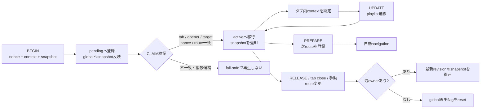

# コメント機能ブランチ コードレビュー修正記録

- 作成日: 2026-08-21
- 修正ブランチ: `codex/fix-comment-feature-review`
- 比較元: `codex/comment-feature-integration` (`29ceb47`)
- 対象: コメント機能、認証・通信、Netflix / Disney+ 統合、再生状態管理

## 1. 目的

`codex/comment-feature-integration` のコードレビューで見つかった、誤ったクリップへのコメント投稿、複数タブ間の状態混線、認証競合、無期限の通信待ち、パネルのライフサイクル不備、Disney+ のDOM更新ループなどを修正する。

今回の変更では、特に次の3点を設計上の軸とした。

1. コメント対象は共有storageではなく、タブ固有の再生コンテキストを正とする。
2. 共有再生状態の書き込みはbackgroundへ集約し、tab IDとnonceで所有権を検証する。
3. 認証・コメント・同期処理は、応答順序とタイムアウトを明示して競合や永久待機を防ぐ。

## 2. 対応結果の概要

| レビュー指摘 | 主な問題 | 対応 | 状態 |
|---|---|---|---|
| コメント対象が全タブ共通 | 別タブで再生を始めると、開いているパネルの表示・投稿先が別クリップへ変わる | `sessionStorage` ベースのタブ固有コンテキストとbackground ownershipを導入 | ロジック・単体テストで対応済み |
| Netflixのクリップ選択が不完全 | 選択したclipを保存せず、古いclipやplaylistへコメントする可能性 | 完全なsnapshotを登録してからcookie設定・新規タブ表示を行う | 対応済み |
| 古い401が新トークンを削除 | コメント通信中の再連携と401処理が競合 | auth書き込みをbackgroundの共通mutexへ集約し、使用トークンを再照合 | 対応済み |
| 成功レスポンスの検証不足 | 壊れたJSONを成功扱いし、空表示や重複投稿につながる | GET 200 / POST 201とAPIレスポンスschemaを厳密検証 | 対応済み |
| background通信が無期限 | 1件の停止でコメント・同期・token refresh・再連携が詰まる | ヘッダー・JSON本文を含む15秒タイムアウトを追加 | 対応済み |
| ログインタブが多重に開く | 連打で複数タブ生成、失敗後の再試行もcooldownで阻害 | in-flight共有、成功後のみcooldown記録 | 対応済み |
| 投稿中の次の下書きが消える | 遅いPOST中に入力した文章を成功応答が消去 | 送信時の本文と現在値が一致する場合だけクリア | 対応済み |
| 曖昧なPOST失敗で重複投稿 | server commit後のtimeout等で再投稿を促す | 一覧を再取得し、下書きを保持してユーザーに確認を促す | 対応済み |
| パネル再注入・切断時の状態不整合 | 新ボタンのARIA表示が残る、listenerがリークする | trigger再登録、open-state通知、切断Observer、一括teardown | 対応済み |
| コメント・メモ・一覧が重なる | プレイヤー幅とsidebar状態が競合 | 3種類のパネルを相互排他化し、元の幅を保存・復元 | 対応済み |
| 入力中も動画shortcutが動く | Space・矢印などがpause/seekを発火 | window capture guard、light-DOM textarea、`stopImmediatePropagation` | 実装済み、Phase 5実機確認済み |
| Disney+のDOM更新が自己再発火 | 同じlabelを書き続け、MutationObserverとrAFがループ | 値が変わった場合だけ`textContent`を更新 | 対応済み |
| SPA遷移・reload・tab closeの混同 | reloadで状態消失、手動遷移で古い状態が残る | route照合、`PREPARE_PLAYBACK_NAVIGATION`、tab lifecycle管理 | ロジック・単体テストで対応済み |

## 3. 認証・コメント通信

### 3.1 認証更新の直列化

認証トークンの保存・解除をcontent scriptから直接storageへ書く方式から、backgroundメッセージ経由へ変更した。

- [authState.js](../src/background/authState.js): token保存・unlinkを`runExclusive`内で処理
- [background.js](../src/background/background.js): `SAVE_EXTENSION_AUTH_TOKEN` / `UNLINK_EXTENSION`を受付
- [extensionSync.js](../src/content/extensionSync.js): site bridgeからbackgroundへ転送
- [comments.js](../src/background/comments.js): 401時に、リクエストで使用したtokenと現在tokenを再照合

これにより、旧tokenで開始したコメントリクエストが401になった直前・直後に再連携しても、新tokenを誤って削除しない。

`extensionInstanceId` の生成もbackground側のin-flight Promiseへ集約し、同時要求で異なるIDが生成される競合を防いだ。

### 3.2 APIレスポンスの検証

[comments.js](../src/background/comments.js) では、HTTP成功だけではなく次の契約をすべて満たした場合だけ成功とする。

- GETはHTTP 200、POSTはHTTP 201
- top-level `ok === true`
- GETの`clipId`が要求したclip IDと一致
- commentの`id`、`clipId`が正のsafe integerで、`userId`は正のsafe integerまたは退会ユーザー匿名化時の`null`
- `username`がstringまたはnull
- `body`が1〜500文字
- `createdAt`が正規化可能なISO日時
- GETの`hasNext`と`nextCursor`が整合

HTTP 200 / 201でも契約違反なら`invalid_response`を返し、UIが空一覧や投稿成功として誤処理しないようにした。

### 3.3 タイムアウトとログインタブ

[request.js](../src/background/request.js) に共通の15秒timeoutを追加した。`fetch()`のレスポンスヘッダー待ちだけでなく、`response.json()`の本文読み込みもAbort対象に含む。

適用先:

- コメントGET / POST
- クリップ同期
- token refresh

コメントは`runExclusive`の待機時間も15秒の期限に含める。タイムアウトした要求が後からmutexを取得しても、新たなfetchは開始しない。

ログインタブは全callerで1つのin-flight処理を共有する。タブ作成に成功した後だけcooldownを保存するため、Chrome側で作成に失敗した場合はすぐ再試行できる。

## 4. タブ別再生コンテキストとownership

### 4.1 タブ固有のコメント対象

[playbackContext.js](../src/content/playbackContext.js) は、現在の`mode`と`clipId`をタブ単位の`sessionStorage`へ保存する。

- 未初期化と「初期化済みだが再生対象なし」を区別
- 初期化済みのnull状態では共有storageへフォールバックしない
- `sessionStorage`が拒否・失敗した場合は、モジュール内メモリを正としてタブ分離を維持
- context変更を同一タブ内イベントでコメントパネルへ通知

[commentPanel.js](../src/content/commentPanel.js) はこのcontextを優先してclip IDを解決する。これにより、Tab Aでコメントを開いたままTab Bで別クリップを再生しても、Tab Aの投稿先は変わらない。

### 4.2 backgroundを共有再生状態の単一writerにする

[playbackOwnership.js](../src/background/playbackOwnership.js) は、`chrome.storage.session`に次のregistryを保持する。

- `pending`: 再生開始前のnonce別handoff。TTLは30秒
- `active`: tab IDごとの所有者、context、snapshot、route
- `revision`: 同時刻の操作でも最新snapshotを決定できる単調増加番号

共有`chrome.storage.local`へ再生状態を書けるのは、このmanagerの直列化された処理だけとした。

### 4.3 claimとnavigationのルール

- URLの`dextPlaybackOwner` nonceを最優先する
- 明示nonceは送信元tab、opener、事前bind済みtargetのいずれかと一致した場合だけclaim可能
- 旧サイト互換のnonceなし経路は、openerに紐づくpendingが厳密に1件の場合だけ許可
- pendingが複数なら`ambiguous_handoff`として安全側で拒否
- legacy BEGINが遅れる場合に備え、nonceなしclaimは最大約1秒再試行
- staleなtab-local nonceは`handoff_not_found`または`route_mismatch`で破棄し、legacy handoffへ再試行
- reloadは同じtab・同じrouteとしてownershipを維持
- 自動playlist遷移は先に次routeを`PREPARE`する
- 手動route変更、明示release、tab終了ではownershipを解除
- owner解除・pending失効後は、残っている最新revisionのsnapshotを復元。何も残らなければ再生flagをreset

## 5. コメントパネルとsidebar

### 5.1 読み込みと投稿

[commentPanel.js](../src/content/commentPanel.js) では、初回GETを共有する`baseLoadPromise`と、context更新中のrefresh queueを追加した。古いレスポンスは`contextVersion` / `requestVersion`で破棄する。

投稿時は送信時のtextarea値を保存し、成功時点の現在値が同じ場合だけクリアする。投稿後に入力した次の下書きは残る。

次のreasonは「serverへ保存された可能性がある曖昧な失敗」として扱う。

- `invalid_response`
- `network_error`
- `timeout`
- `background_unavailable`
- `request_failed`

この場合は本文を保持したまま一覧を再取得し、即時の再投稿を促さない。

### 5.2 ライフサイクル

- 再生成されたtriggerをactive controllerへ登録し直す
- すべてのコメントボタンへ`aria-expanded`を同期
- パネルhostがSPAのDOM差し替えで切断された場合はObserverでclose
- storage、visibility、keyboard、beforeunload、custom event、MutationObserverをclose時に解除
- ログインボタンとrefreshをin-flight中は再入不可にする

### 5.3 keyboardと相互排他

UI本体はShadow DOMに残し、textareaだけをlight DOMに置いてslot表示する。配信サイト側からも実際の`textarea`がイベントtargetとして見えるため、通常の入力欄除外ロジックが働きやすくなる。

コメントパネルとメモはwindow captureでキーイベントを止める。メモ側も`stopImmediatePropagation()`へ統一した。

コメント、録画メモ、Netflixのクリップ一覧は同時に開かない。別sidebarを開く前に現在のsidebarを正式に閉じ、プレイヤー幅は最初の値へ戻す。

## 6. Netflix / Disney+統合

### 6.1 Netflix

- [netflixClipSelection.js](../src/content/netflixClipSelection.js) で、clip・clip ID・mode・owner nonceを1つのsnapshotとして登録
- handoff完了後にcookie設定と`window.open`を実行
- 起動時は共有storageではなくclaim結果のsnapshotから単体・playlistを開始
- playlist遷移はowner確認付きUPDATEを完了してからseekまたはURL遷移
- generationと終了監視解除処理により、古いseek loopや`timeupdate` listenerを停止
- controls再生成時もコメントボタンのopen状態とARIAを同期
- 手動SPA遷移ではcontext、コメント、監視処理を解除

### 6.2 Disney+

- Netflixと同じclaim / update / prepare navigation方式へ統一
- 起動時に古い共有modeをそのまま再生せず、claim結果のsnapshotを使用
- 同一URL・別URLのplaylist遷移をownership管理下へ移行
- button labelは値が変わった場合だけ更新し、MutationObserverの自己再発火を防止
- documentがすでにload済みの場合にもmode起動処理を実行

### 6.3 localhost再生ブリッジ

[getClipData.js](../src/content/getClipData.js) の`clipSelected`、`SET_CLIP_DATA`、`PLAY_PLAYLIST_START`は、共有storageへ直接モードを書かず、nonce付きの`BEGIN_PLAYBACK_HANDOFF`をbackgroundへ送るよう変更した。

拡張自身が遷移先を作る経路では、URLへ`dextPlaybackOwner`を付与する。既存サイトがnonceを付けない経路は、openerと一意なpendingを使う互換claimで処理する。

## 7. 変更ファイル

### 新規コード

| ファイル | 役割 |
|---|---|
| [authState.js](../src/background/authState.js) | 認証保存・解除のbackground直列化 |
| [request.js](../src/background/request.js) | background fetchの15秒timeout |
| [playbackOwnership.js](../src/background/playbackOwnership.js) | tab / nonce / route単位のownership manager |
| [playbackContext.js](../src/content/playbackContext.js) | タブ固有のコメント対象context |
| [playbackOwnership.js](../src/content/playbackOwnership.js) | content側ownership client |
| [domUpdates.js](../src/content/domUpdates.js) | 同値DOM更新の抑制 |
| [netflixClipSelection.js](../src/content/netflixClipSelection.js) | Netflix選択clipの原子的commit |

### 主な変更コード

- [background.js](../src/background/background.js)
- [comments.js](../src/background/comments.js)
- [sync.js](../src/background/sync.js)
- [tokenRefresh.js](../src/background/tokenRefresh.js)
- [commentPanel.js](../src/content/commentPanel.js)
- [common.js](../src/content/common.js)
- [content_netflix.js](../src/content/content_netflix.js)
- [content_disney.js](../src/content/content_disney.js)
- [extensionSync.js](../src/content/extensionSync.js)
- [getClipData.js](../src/content/getClipData.js)

### 新規テスト

- [backgroundAuth.test.js](../test/backgroundAuth.test.js)
- [backgroundRequest.test.js](../test/backgroundRequest.test.js)
- [integrationHelpers.test.mjs](../test/content/integrationHelpers.test.mjs)
- [playbackContext.test.js](../test/playbackContext.test.js)
- [playbackOwnership.test.js](../test/playbackOwnership.test.js)
- [playbackOwnershipClient.test.js](../test/playbackOwnershipClient.test.js)

既存の`comments.test.js`、`commentPanel.test.js`、`content/common.test.mjs`も拡張した。初回レビュー修正時点では追加52件・全体75件で、Phase 2〜4のbridge / ownership回帰テスト追加後は全体95件となった。

## 8. 自動検証結果

2026-08-21時点の結果。

| コマンド | 結果 |
|---|---|
| `npm test` | 95 / 95 pass |
| `npm run lint` | exit 0、error 0、warning 0、info 0 |
| `npm run build` | webpack production build成功 |
| `git diff --check` | 空白エラーなし |

テスト時に`package.json`へ`type: module`がないことによる`MODULE_TYPELESS_PACKAGE_JSON`警告が出るが、テスト失敗ではない。Biomeのlint diagnosticsは0件。

自動テストで主に確認している内容:

- auth保存・unlink・401・再連携の順序
- login tabの多重作成防止と失敗後再試行
- response schema、status、cursor、clip ID整合
- fetch header / JSON body / mutex待ちのtimeout
- 下書き保持と曖昧POST判定
- sidebar teardown、相互排他、元幅復元
- Disney+同値label更新の抑制
- Netflix snapshot登録後に画面を開く順序
- tab-local contextとstorage failure fallback
- rapid handoff、2 owner間のsnapshot復元、reload、手動route、自動route、期限切れ
- 明示URL nonce、stale session nonce、legacy retry、曖昧handoff拒否

## 9. 実ブラウザでの確認項目

このリポジトリにはPlaywright / Cypress / Selenium等のE2E環境がない。次はChromeへextensionを読み込んだ実機smoke testが必要。

1. Netflix / Disney+でサイト起点の単体clipを開き、正しいclipのコメントが表示・投稿される。
2. playlistの同一URL遷移と別URL遷移で、コメント対象と再生区間が次clipへ変わる。
3. Tab AとTab Bで別clipを再生し、片方の再生・投稿・closeが他方へ影響しない。
4. 再生タブをreloadしてownershipが維持され、通常の別作品へ移動すると解除される。
5. URLのquery削除やservice側redirect後もhandoffが成立する。
6. controlsを表示・非表示してボタンが再生成されても、色と`aria-expanded`が一致する。
7. コメント・メモ入力中にSpace、矢印、Enter、Escape、IME変換を操作し、意図しないpause / seekが起きない。
8. site CSSの影響でtextareaの色、サイズ、pointer操作が崩れない。
9. ログインボタンを連打してもタブが1枚だけ開き、タブ作成失敗後は再試行できる。
10. API応答遅延・401・再連携時に、下書きと新tokenが保持される。

実機確認前には`npm run build`を実行し、manifestが参照する`dist/content.js`、`dist/content_disney.js`、`dist/background.js`、`dist/extension_link.js`、`dist/getClipData.js`を更新する。

## 10. 既知の未対応・残リスク

### 10.1 localhost bridgeの入力境界

Phase 2で[playbackBridgeValidation.js](../src/shared/playbackBridgeValidation.js)を追加し、`clipSelected`、`SET_CLIP_DATA`、`PLAY_PLAYLIST_START`を同じ正準schemaへ統一した。[getClipData.js](../src/content/getClipData.js)はwebpack entry化し、manifestは`dist/getClipData.js`を参照する。

実装済み:

- cookie whitelistとcookie単位の安全なdecode
- detailを正本とするclip ID整合確認
- 正のsafe integer ID、Netflix / Disney+ service、HTTPS hostname、時刻範囲の検証
- playlist itemの正規化、欠落orderのindex補完、明示的不正値・重複の拒否
- 最大100件、raw / 正規化後とも512 KiBの上限
- 不正入力時のall-or-nothing拒否と安全なresult message
- background ownership managerでのnested clip / queue再検証
- owner / pending消滅時の`clip`、`playQueue`、`nextClip`消去
- canonical absolute URLに合わせたNetflixのservice-aware遷移

Phase 4ではlocalhost site（`C:\dev\react--site`）の実装も確認し、`clipSelected.detail.clipId`送信、handoff結果の同一origin通知、ユーザー向け成功・失敗表示まで結合した。site側のroot layoutには認証bridgeとhandoff結果表示を常設し、content scriptの起動が遅い場合は認証状態確認を最大3回再試行する。

### 10.2 Disney+のSPAイベント境界

Phase 5の実Chrome試験で、isolated world内のhookではページ本体の`history.pushState`を捕捉できず、backgroundがownershipを解除した後もcontent側にclip contextとコメントパネルが残ることを再現した。

Disney+でも`src/util/history_change.js`を`document_start`のMAIN world content scriptとして実行し、content側は`historyChange`イベントを監視する構成へ変更した。手動SPA遷移後にcontext、owner nonce、コメントパネルが解除され、global playback stateもresetされることを再確認済みである。

全タブ共有だった`chrome.storage.local.autoNav`はPhase 4後の再監査で既に廃止し、background ownershipのprepared routeをtab / owner nonce単位でclaim結果へ引き継ぐ方式へ変更した。Phase 5では異なるowner・次clip・次URLを持つDisney+の2タブを同時に遷移させ、各タブがそれぞれのnonceとclip IDを維持することを実Chromeで確認した。

### 10.3 ブラウザ固有の順序とサイト干渉

- redirectでURL nonceが消え、opener / target bindingも取得できない場合は、安全側で再生開始を拒否する。この場合、誤ったclipは再生しないが、正しい再生も始まらない。
- legacy retryは最大約1秒であり、service workerのcold startを含む実時間は未検証。
- `tabs.onUpdated`、`tabs.onRemoved`、beforeunload、content reinjectionの順序はmockテストのみ。
- slotted textareaはlight DOMのため、ページCSS / JSの影響を受ける。
- 先に登録済みのsite側window-capture listenerは、後から登録したguardで遡って停止できない。

これらは「ロジック上の誤ったclipへのフォールバックを禁止する」ところまでは実装済みだが、配信サイトとChromeの実イベント境界は実機smokeで確認する必要がある。

## 11. マージ前の完了条件

- [x] unit test 98件成功
- [x] lint error / warning / info 0
- [x] production build成功
- [x] `git diff --check`成功
- [x] Netflix実機smoke
- [x] Disney+実機smoke
- [x] localhost siteとのAPI・auth・handoff結合確認
- [x] localhost bridge入力検証を実装し、回帰テストを追加

## 12. Mergeまでの作業リスト

### Phase 1: bridge契約を確定する

- [x] cookieから受け付けるキーのwhitelistを確定する
  - `title`, `user`, `url`, `service`, `clipId`, `username`
  - legacyの`starttime` / `endtime`は`startTime` / `endTime`へ正規化
- [x] 単体clipとplaylist itemの正準schemaを決める
- [x] playlistの最大件数とシリアライズ後の最大サイズを決める
- [x] 不正データは一部採用せず、handoff全体を拒否する方針に統一する
- [x] 拒否時のconsole warningとユーザー通知方針を決める

完了条件: localhost site側の実データ例と矛盾しない入力契約が文章化されている。  
完了資料: [Localhost playback bridge input contract v1](./localhost-playback-bridge-contract-v1.md)

### Phase 2: localhost bridgeを修正する

- [x] cookieをwhitelistで抽出し、未知のcookieを保存しない
- [x] cookie decodeをtry/catchし、不正なpercent encodingでlistenerを落とさない
- [x] `clipSelected`のdetailとcookieから正準clipを生成する
- [x] `SET_CLIP_DATA`で`payload` / `clip`の存在と型を確認する
- [x] clip IDを正のsafe integerへ正規化する
- [x] `service`とURLを検証する
- [x] `startTime` / `endTime`を有限数へ正規化し、`0 <= startTime < endTime`を検証する
- [x] playlistの各itemを正規化する
- [x] `order`を非負整数へ統一し、重複を拒否する
- [x] queue件数・サイズが上限を超えた場合はhandoffを開始しない
- [x] `BEGIN_PLAYBACK_HANDOFF`失敗時に後続navigationを開始しない経路を確認する
- [x] owner / pendingがないglobal resetで、不要な`clip` / `playQueue` / `nextClip`も消去する
- [x] background側でもnested clip / queueを最低限再検証し、多層防御にする

完了条件: 不正入力が`chrome.storage.local`、ownership registry、再生contextのどこにも保存されない。

### Phase 3: 自動テストを追加する

- [x] 許可cookieだけがclipへ入るテスト
- [x] legacyの小文字時刻が正準化されるテスト
- [x] 不正percent encodingで例外にならないテスト
- [x] `SET_CLIP_DATA`のpayload欠落・clip欠落を拒否するテスト
- [x] 0、負数、unsafe integer、非数値clip IDを拒否するテスト
- [x] 不正URL・未対応serviceを拒否するテスト
- [x] NaN、Infinity、負の開始時刻、終了 <= 開始を拒否するテスト
- [x] playlistの空配列、不正item、order重複、上限超過を拒否するテスト
- [x] 不正queueでglobal snapshotやownerが更新されないテスト
- [x] ownerなしresetで機微なclip / queueデータが残らないテスト
- [x] `npm test`を全件成功させる
- [x] `npm run lint`でerror / warning / info 0を確認する
- [x] `npm run build`を成功させる
- [x] `git diff --check`を成功させる

完了条件: bridgeの正常系・異常系が自動テストされ、全検証コマンドが成功する。

### Phase 4: localhost siteとの結合確認

- [x] Chromeで最新`dist`を読み込む
- [x] 未連携状態からlogin tabを開き、siteと連携できる
- [x] unlink後にtokenが消え、再連携で新tokenが保存される
- [x] コメントGET / POSTがBearer tokenと正しい`extensionInstanceId`で成功する
- [ ] 古いtokenの401と再連携が重なっても新tokenが消えない
- [x] localhost起点の単体clipをNetflixで開始できる
- [x] localhost起点の単体clipをDisney+で開始できる
- [x] nonce付きhandoffが正しいclipへclaimされる
- [x] 既存のnonceなしhandoffが一意なopener pendingへclaimされる
- [x] URLからnonceを削除した後もreloadでownershipを復元できる
- [x] playlistの同一URL遷移を確認する
- [x] playlistの別URL・別service遷移を確認する

完了条件: site、extension、background、配信サービスを通る主要な正常系が実Chromeで成立する。

#### Phase 4 実施結果（2026-08-21）

検証環境:

- Chrome `151.0.7922.138`
- extension branch `codex/fix-comment-feature-review`
- localhost site revision `9f591862fddc9a71d88590c489ac47ffd311c6a9` にPhase 4の未commit修正を追加
- localhost DB migration `20260809000000_harden_clip_comments` を適用

結合確認結果:

- siteのextension API smokeは31 / 31成功した。
- 実extensionのBearer tokenと36文字の`extensionInstanceId`でコメントGET / POSTが成功した。作成した検証コメントは確認後に削除した。
- unlinkでtokenと現instanceの連携行が消え、同じinstance IDの再連携で別tokenが保存された。
- localhostの単体再生からNetflix clip 61をnonceなし互換経路でclaimし、コメント対象、再生context、コメントボタンが一致した。
- localhostの単体再生からDisney+ clip 24をnonceなし互換経路でclaimし、コメント対象、再生context、コメントボタン、開始位置812秒が一致した。
- nonce付きplaylist handoffをDisney+ clip 23でclaimし、同一URLのclip 24へ遷移後、`currentClipOrder`、`currentClipId`、コメント対象、開始位置812秒が更新された。
- Netflix clip 61からDisney+ clip 24への別URL・別service遷移が同じtabとowner nonceで成立した。
- URLから`dextPlaybackOwner`を除去してreloadしても、tab-local nonceからclip 24のownershipを復元した。今回の実データではservice側redirect自体は発生しなかった。
- siteのhandoff成功・失敗通知は同一window / 同一originだけを受け、成功時`role=status`、失敗時`role=alert`で表示された。

実機で判明して修正した結合不整合:

1. siteの`ExtensionLinker`がroot layoutにmountされておらず、自動連携が開始されなかった。
2. siteの初回認証確認がcontent scriptの`document_idle`登録より先に1回だけ送られ、起動競合で未連携表示が残った。250ms間隔・最大3回の再試行へ変更した。
3. siteが`EXTENSION_PLAYBACK_HANDOFF_RESULT`を表示していなかったため、共通status / alertを追加した。
4. siteの単体再生が`service` cookieを書かず、extensionが`invalid_service`で拒否したため、許可済みserviceをcookieへ追加した。
5. siteのDisney+正式コードが`DISNEY_PLUS`、extensionの受理値が`Disney+` / `disney`だけだったため、`DISNEY_PLUS`を`disneyplus`へ正規化した。

検証コマンド:

- extension: `npm test` 95 / 95、`npm run lint` diagnostics 0、`npm run build`成功
- site: `npm run codex:quick` 141 / 141、lint成功、typecheck成功
- site API: `npm run smoke:extension` 31 / 31

未完了項目:

- 古いtokenの401応答と再連携の保存が同一実時間で交錯するケースは、実APIでは意図的に競合させていない。旧token 401後の再連携、再連携後の旧401、置換済みtokenを消さないCASの3経路は自動テスト済みであり、通常のunlink / relink実機確認も成功している。
- 既存playlist 1のNetflix URLは現在のアカウントでplayerを生成できない古い作品だったため、playlist遷移はsiteと同じ`playQueue`形式の一時fixtureで確認した。DBにはfixtureを保存していない。

### Phase 5: 複数タブとUIの実機smoke

- [x] Tab A / Tab Bで別clipを再生し、コメント対象が混線しない
- [x] Tab Bを閉じてもTab Aの再生・コメントが維持される
- [x] reload後も同じclipのownershipが復元される
- [x] 手動で別作品へ移動すると再生contextとコメントパネルが解除される
- [x] Disney+の手動SPA遷移をcontent側が検知できる
- [x] Disney+の2タブ同時自動遷移で`autoNav` markerが混線しない
- [x] controls再生成後もコメントボタンの色とARIAが一致する
- [x] コメント・メモ入力中のSpace、矢印、Enter、Escape、IMEを確認する
- [x] site CSSでtextareaの表示・操作が崩れない

失敗時の対応:

- Disney+のSPA変更を検知できなければ、Netflixと同様のMAIN-world history hookへ移行する
- `autoNav`が混線する場合は、owner nonceまたはtab IDに紐づく状態へ変更する
- redirectでclaimできない場合は、URL nonceとtarget bindingの引き継ぎ方法を見直す

完了条件: 誤ったclipへ再生・コメント投稿しないことと、入力UIが配信サイトの操作と競合しないことを確認する。

#### Phase 5 実施結果（2026-08-22）

検証環境:

- Chrome `151.0.7922.138`（Windows、専用プロフィール、unpacked extension）
- extension: `codex/fix-comment-feature-review`、HEAD `6293cb7` + Phase 1〜5の未commit差分
- localhost site / API: `C:\dev\react--site`、HEAD `9f59186` + Phase 4の未commit結合差分

確認結果:

- Netflix clip 61とDisney+ clip 24を別タブで同時にowner化し、両タブのsession context、owner nonce、コメントパネルが別々に維持された。global stateが後から開いたtabへ切り替わっても、既存tabのコメント対象は変化しなかった。
- Disney+側のtabを閉じてもNetflix側のclip 61、owner nonce、開いていたコメントパネルは維持された。
- Netflix clip 61をreloadし、URL queryを除去済みの状態でも同じtab-local nonceとclip 61 contextが復元された。
- NetflixでMAIN-world `history.pushState`による手動route変更を行い、context、nonce、コメントパネル、global stateが解除された。
- Disney+では最初の試験で、isolated-world history hookがMAIN-worldのroute変更を捕捉できない不具合を再現した。MAIN-world hookへ修正後、同じ手順でcontext、nonce、パネルの解除を確認した。
- 一時fixtureを使い、Disney+ Tab Aをclip 23からclip 101 / 別URLへ、Tab Bをclip 24からclip 102 / 別URLへほぼ同時に自動遷移させた。両tabとも固有nonceと期待clip IDを維持し、marker混線はなかった。fixtureはDBへ保存していない。
- Disney+でコメントパネルを開いたままコメントbuttonをDOMから除去し、再生成後も`aria-expanded=true`とactive表示が維持され、新buttonから閉じると両方がfalseへ戻った。
- 実clip 24のコメントtextareaでSpace、矢印、Enter、Escape、日本語入力・composition eventを実行した。document / page側のkeydownへ伝播せず、動画はpause位置を維持し、Escapeだけがパネルを閉じた。
- メモ入力ではSpace、矢印、Escape、日本語入力、IME変換中Enterを実行した。page側へ伝播せず、動画状態とsidebarを維持した。通常Enterは保存操作になるため、不要なAPI書き込みを避けてIME変換中Enterで確認した。
- textareaは`color: rgb(17, 17, 17)`、白背景、`pointer-events:auto`、実寸`387.3 x 82px`で、Disney+のpage CSSによる表示・操作崩れはなかった。

試験上の境界:

- Netflix同士の同時player起動はサービス側のM7020で拒否されたため、一般の2tab分離はNetflix / Disney+のcross-service、同一serviceの同時自動遷移はDisney+ 2tabで確認した。
- 実IME候補ウィンドウの視覚確認は自動化対象外だが、composition event、入力値、キー伝播、動画状態は確認した。

### Phase 6: Merge準備

- [x] 実機確認日、Chrome version、site revision、API revisionを記録する
- [x] 成功・失敗したsmoke結果を本資料へ追記する
- [x] 未解決項目があればissue化し、merge blockerかfollow-upかを明記する
- [x] 最終diffを再レビューする
- [x] commitを作成する
- [x] PRを通常レビュー可能な状態にする（既存draft PRは無いため、通常PRを新規作成）

最終完了条件: Phase 1〜5が完了し、残課題と検証証跡をレビュー可能な状態でmergeする。

#### Phase 6 実施結果（2026-08-23）

- 実機smoke実施日: 2026-08-22
- Chrome: `151.0.7922.138`（Windows、専用profile、Load unpacked）
- extension: branch `codex/fix-comment-feature-review`、レビュー開始HEAD `6293cb7` + Phase 1〜5差分
- localhost site / API: `C:\dev\react--site`、branch `feat/clip-comments-site-ui-squashed`、ローカルHEAD `9f591862fddc9a71d88590c489ac47ffd311c6a9`
- site remote revision: [FigFingers/react--site#62](https://github.com/FigFingers/react--site/pull/62) のHEAD `486bca3141b897833844e87b5c12cac9040a8dba`
- 最終自動検証: `npm test` 98/98、`npm run lint` error 0、`npm run build`成功、`git diff --check`成功

最終diffでは、backgroundのauth / timeout / comment schema、tab-scoped playback ownership、localhost bridge validator、Netflix / Disney+ lifecycle、コメントpanel、manifest / webpack、テスト、契約資料を再確認した。新たなコード上のmerge blockerは見つからず、資料冒頭に残っていた退会ユーザーの`userId: null`契約だけを現実装へ合わせて訂正した。

未解決項目はsite PR #62で追跡する。site側の`service` cookie追加とhandoff結果UIは実Chromeで成立しているが、上記remote revisionには未収録であるため、extensionのmerge blockerとする。site側の必要差分をcommit・pushし、PR #62のremote HEADに含まれたことを確認するまではextensionをmergeしない。Netflixの同一アカウント2player制限（M7020）と実IME候補ウィンドウの目視未実施は試験環境上の境界であり、今回のコードmerge blockerにはしない。

## 12. 2026-08-22 未push差分レビューの追加対応

`docs/unpushed-review-2026-08-22.md`を現在のextension・site両作業ツリーへ再照合し、成立した指摘と追加で判明した契約差を修正した。

| 項目 | 対応 |
|---|---|
| コメント本文の500文字境界 | UTF-16 code unitではなくUnicode code pointでPOST入力とGET/POSTレスポンスを検証。textareaのnative `maxLength`も外し、絵文字を500 code pointまで扱えるよう統一 |
| 退会ユーザーのコメント | siteが匿名化時に返す`userId: null`を正常レスポンスとして許可 |
| 完了済みrefreshの誤timeout | fetchとJSON bodyが完了した後は壁時計を再判定せず、AbortSignalが実際に発火した場合だけtimeout扱い |
| Disney+ループ切替 | playlist contextをclip loaderが消さず、非clip modeでは現在再生を停止しない |
| Disney+ auto-navigation | 全タブ共有`chrome.storage.local.autoNav`を廃止。background ownershipのprepared routeをclaim結果へ引き継ぎ、tab/nonce単位で判定 |
| Netflixクリップ選択エラー | unsupported serviceと一般エラーをalertでユーザーへ通知 |
| Netflix metadata listener | listener登録時のvideo要素をremoverへ固定し、プレイヤー差し替え後も正しい要素から解除 |
| 通常ページのclaim | backgroundが`retryable:false`を返した場合は1回で停止。legacy child handoffだけ待機を継続 |
| ownershipのno-op処理 | ownerも対象pendingもないnavigationではregistryを書き戻さず、global playbackが既に空ならreset書き込みも省略 |
| route/owner定義 | owner query/storage keyとroute正規化を共通validator moduleへ集約し、canonical snapshot到達後の相対URL死コードを削除 |
| コメント対象解決 | 本番で到達しないglobal playback storage fallbackを削除し、tab-local contextが無ければfail closed |
| コメントlabel | shadow rootからlight DOM textareaを参照できない`htmlFor`を削除し、既存の`aria-label`とclick focus処理へ一本化 |

仕様判断として、playback bridge v1はNetflix / Disney+限定を維持する。Prime / YouTubeを含むplaylistの部分再生互換は今回のmerge blockerに含めず、必要なら契約versionを更新する別変更として扱う。

site側の`service` cookie追加はローカル作業ツリーにのみ存在するため、site commit・pushとremote branch包含確認が完了するまではmerge blockerとして残る。
